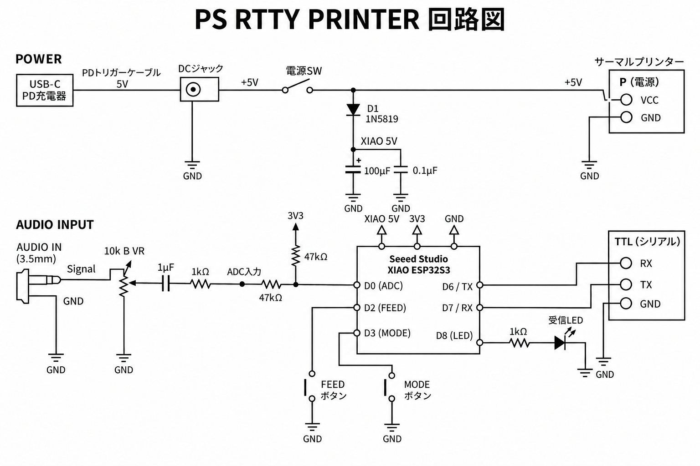

```markdown
# PS RTTY PRINTER

XIAO ESP32S3と58mmサーマルプリンターを使用した、アマチュア無線RTTY受信用の小型テレプリンターです。

無線機やPCからRTTY音声を入力すると、ESP32S3でMARK/SPACEを検出し、ITA2（Baudot）として復号して紙へ印字します。

昔の機械式RTTYテレプリンターを、現代のマイコンとサーマルプリンターで小型化して再現することを目的とした実験機です。



## 主な仕様

- MCU：Seeed Studio XIAO ESP32S3
- プリンター：58mm TTLサーマルプリンター
- RTTY速度：45.45 baud
- Shift：170 Hz
- MARK：2125 Hz
- SPACE：2295 Hz
- 文字コード：ITA2 / Baudot
- プリンター通信：TTL UART 9600bps / 8N1
- 電源：5V
- オーディオ入力：3.5mm
- 入力レベル調整：10kΩ BカーブVR
- FEEDボタン
- MODEボタン
- RTTY受信状態LED

## 動作モード

MODEボタンで次の3モードを切り替えます。

- `AUDIO NORMAL`
  - 通常極性でRTTY音声を復調
- `AUDIO REVERSE`
  - MARK / SPACEを反転して復調
- `USB`
  - PCからUSBシリアルで受け取った文字をサーマルプリンターへ出力

電源投入時は `AUDIO NORMAL` で起動します。

## 起動時印字

電源を入れると、プリンターへファームウェア情報と動作条件を印字した後、RTTY受信待機状態になります。

例：

```text
PS RTTY PRINTER
FW: 1.01
MCU: XIAO ESP32S3
TTL: 9600 8N1
RTTY: 45.45 / 170
MARK 2125 / SPACE 2295
MODE: AUDIO NORMAL
READY
```

RTTYを受信すると文字を内部バッファへ蓄積し、改行または一定時間の無信号を検出すると1行ずつ印刷します。

## 電源

5V系で統一しています。

USB-C PD電源から5Vを取り出し、

- サーマルプリンター：5Vを直接供給
- XIAO ESP32S3：1N5819を経由して5Vへ供給

としています。

サーマルプリンターは印字時に大きな電流が流れるため、5V / 2A以上、できれば5V / 3A程度の電源を推奨します。

## 回路

回路図：

`RTTYPrinter.png`

プリンターとの通信にはRS232ではなくTTLを使用します。

実機プリンターのTTL端子は、

```text
VCC / CTS / TX / RX / GND
```

となっており、本機では主に

```text
XIAO D6 / TX → Printer RX
XIAO GND     → Printer GND
```

を使用します。

## Firmware

Arduino IDEからXIAO ESP32S3へ書き込みます。

現在のファームウェア：

`PS_RTTY_PRINTER_v1_01.ino`

Arduino IDEでは、

```text
Board: Seeed Studio XIAO ESP32S3
USB CDC On Boot: Enabled
```

として使用します。

## Background

RTTYは、無線信号で文字情報を送り、受信側で自動的に紙へ印字する通信方式として長い歴史を持っています。

その源流のひとつには、1921年にMorkrum社の無線テレタイプ装置が米海軍で実演された例があります。

PS RTTY PRINTERは、そのような古典的なRTTYテレプリンターの考え方を、ESP32とサーマルプリンターで現代的に再構成したものです。

## 注意

本機はアマチュア無線・電子工作用途の実験機です。

使用する無線機、音声出力レベル、プリンターモジュールによって受信感度や動作条件が異なる場合があります。
```

これくらいがちょうどいいと思います。

特に最後の **1921年 Morkrum → 2026年 XIAO ESP32S3** の話は、このプロジェクトの面白さがかなり伝わるので、READMEに残しておきたいです。
